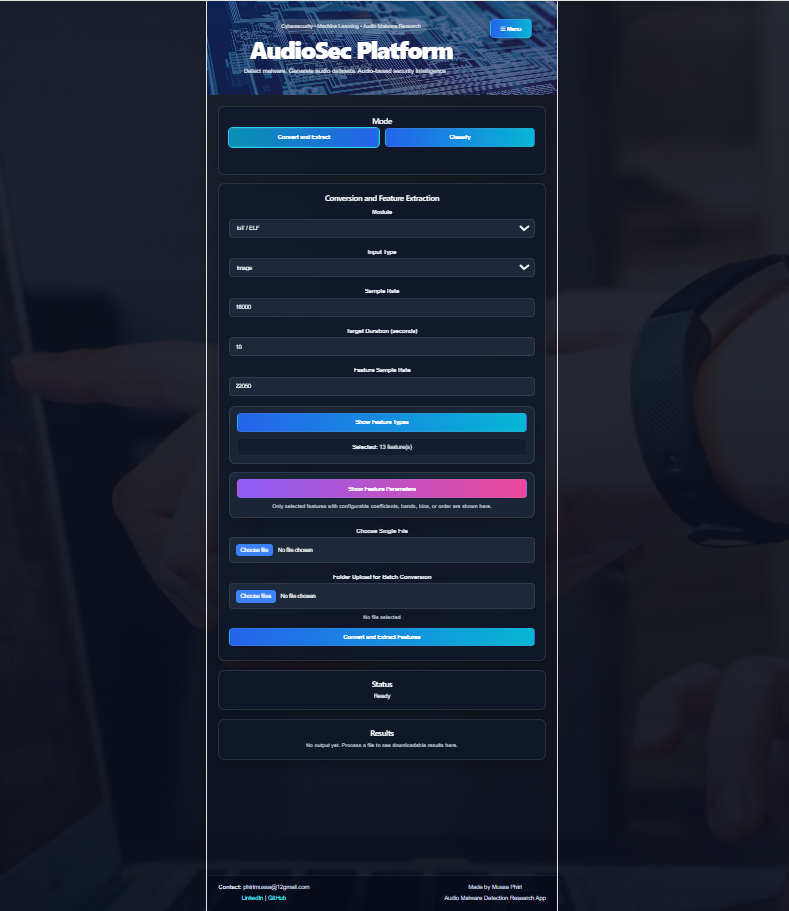

# AudioSec Platform

**Cybersecurity • Machine Learning • Audio Malware Research**

Detect malware. Generate audio datasets. Audio-based security intelligence.




## About

This application was designed to support research and experimentation in audio-based transformation, feature extraction, and malware detection workflows. It enables users to convert supported inputs — images, executable binaries, APK files, and audio files — into audio representations that can then be analysed using established signal processing descriptors.

The system integrates conversion, feature extraction, structured export, and model-based classification within one interface. Extracted results can be saved in CSV format, allowing direct use in machine learning, statistical analysis, temporal drift analysis, and comparative experimental studies.

## Background

Audio feature extraction provides compact and informative representations of signals across time and frequency. In audio-based cybersecurity workflows, binary or visual data may be transformed into sound representations, after which descriptive features can be extracted to capture energy, spectral shape, harmonic structure, temporal change, and other signal characteristics. These features make it possible to analyse transformed artefacts using conventional machine learning methods in a structured way.

## Features

- **Multi-format conversion** — APK, ELF binaries, and images can be converted into audio representations
- **Feature extraction** — MFCC, Zero Crossing Rate, Spectral Centroid, Spectral Contrast, Spectral Bandwidth, Spectral Flatness, Spectral Rolloff, RMS, Chroma (STFT/CENS/CQT), Mel Spectrogram, and Poly Features
- **Structured export** — extracted features are exported to CSV, ready for machine learning, drift analysis, or statistical evaluation
- **Malware classification** — trained models classify converted audio using extracted feature sets
- **Dataset generation** — the conversion pipeline can be used independently to build audio datasets from APK, ELF, or image sources

## Application Areas

- Cybersecurity and malware detection
- Animal sound classification
- Bee acoustic monitoring
- Environmental sound recognition
- Machine condition monitoring
- Speech and speaker analysis
- Research on transformed image or signal representations

## Tech Stack

**Backend:** Python (FastAPI), audio/ML libraries for feature extraction and classification
**Frontend:** React + Vite (TypeScript)
**Models:** Trained classifiers stored via Git LFS (`*.pkl`)

## Project Structure

```
audio-security-platform/
├── backend/
│   ├── app/
│   │   ├── models/          # Trained classification models (.pkl, tracked via Git LFS)
│   │   ├── outputs/         # Generated audio/feature outputs (not tracked)
│   │   ├── routes/          # API routes (classify, convert, features, files)
│   │   ├── services/        # Core logic (conversion, feature extraction, classification)
│   │   └── main.py
│   ├── requirements.txt
│   └── run.py
└── frontend/
    ├── src/
    │   ├── api.ts
    │   ├── App.tsx
    │   └── ...
    └── package.json
```

## Getting Started

### Prerequisites
- Python 3.x
- Node.js
- [Git LFS](https://git-lfs.github.com/) (required to pull the trained model files)

### Clone the repo
```bash
git lfs install
git clone https://github.com/MusaIP12/audio-security-platform.git
cd audio-security-platform
```

### Backend
```bash
cd backend
pip install -r requirements.txt
python run.py
```

### Frontend
```bash
cd frontend
npm install
npm run dev
```

